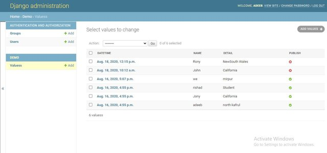

# Django Project
Basic django learning project. I have applied CRUD(create Read Update Delete) operation on this project.

# Navigate 
For read all in formation => Method : GET 
Route : http://http://127.0.0.1:8000/values

For delete in formation => Method : POST
Route : http://127.0.0.1:8000/values/id/delete

For add in formation => Method : POST
Route : http://127.0.0.1:8000/values/add

For update in formation => Method : POST
Route : http://127.0.0.1:8000/values/id/update

